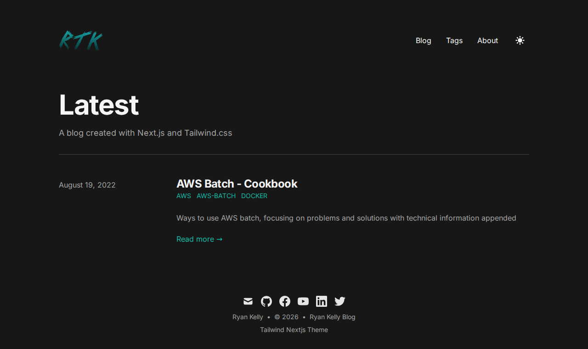
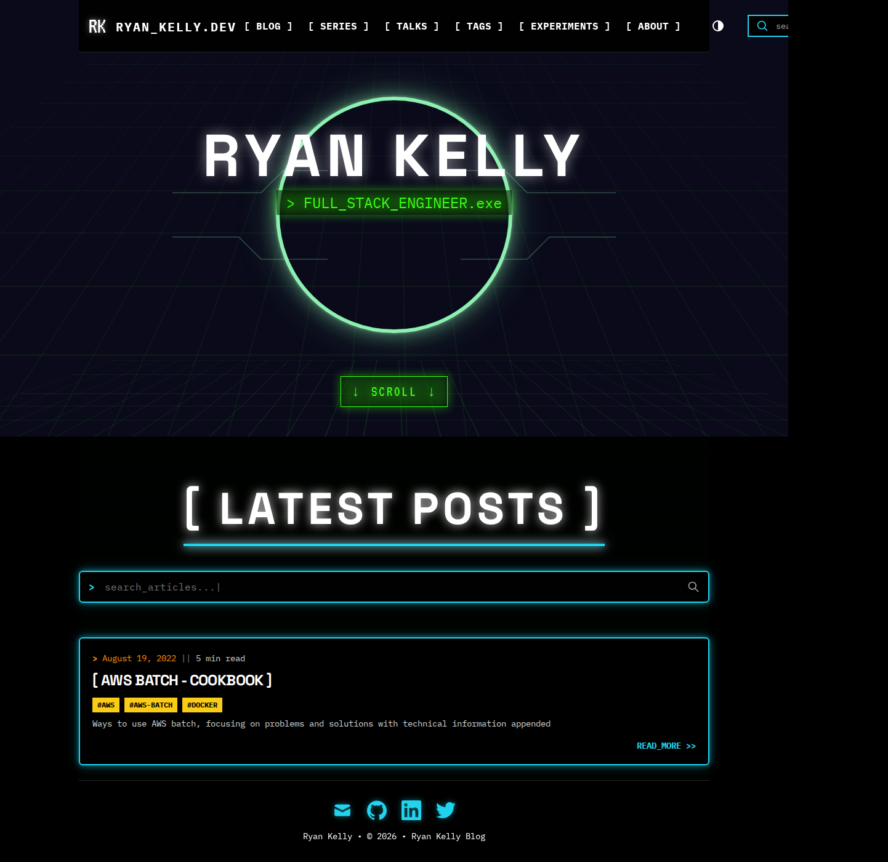
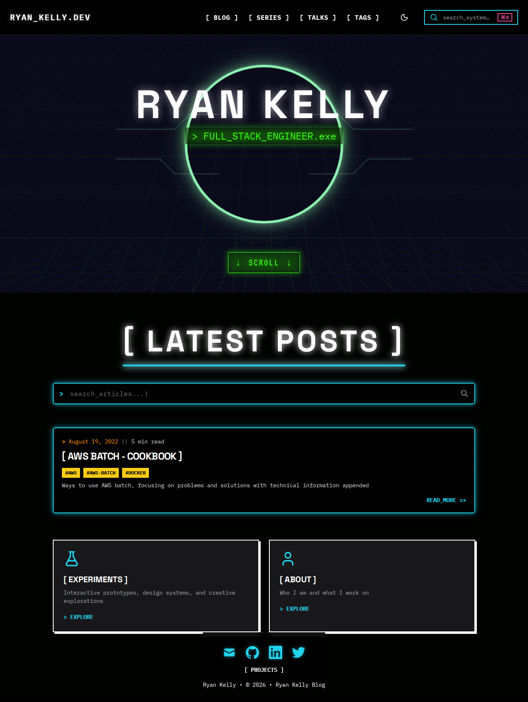
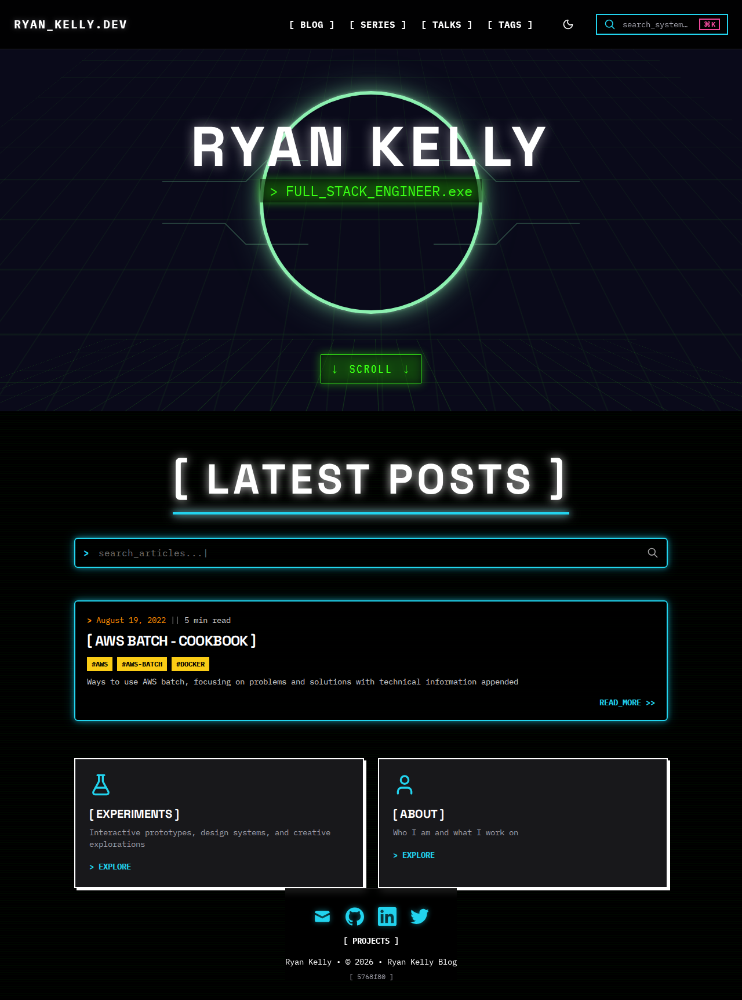

# Colour heritage

**Siblings:** [`palette-provenance.md`](./palette-provenance.md) (how the current palette was
solved) · [`adr/0003`](./adr/0003-two-levels-independently-authored.md) (why there are two
themes) · [`data/colour-audit.tsv`](./data/colour-audit.tsv) (the full index)

This file exists so that nothing is lost. The palette is being narrowed to ten hues per theme,
and **162 values that were once in use are being retired**. Their hex codes, the era they
belonged to, and the reason they went are recorded here rather than only in git history, where
nobody would find them.

Unlike `palette-provenance.md`, this file *does* name colour values — deliberately. Retired
values are not a second origin, because nothing may read them. They are a record.

---

## The five eras

Screenshots are the committed `homepage-dark` visual-regression baseline from
`rtkelly13/blog`, pulled at each era boundary. They are the real rendered page, not a
reconstruction.

### 1 · Starter template — 2021-08-09 → 2026-06-28



Nearly five years on `tailwind-nextjs-starter-blog`, unchanged. Flat dark grey ground, a teal
link colour, system sans-serif, and the template's own tagline still in place — *"A blog
created with Next.js and Tailwind.css"*. No brand.

The only palette was the starter's Prism syntax pastels, in `tailwind.config.js`:

| | |
|---|---|
| `#ff8383` `#b5f4a5` `#ffe484` `#93ddfd` `#d9a9ff` | inherited, never chosen |

**Why it went:** it was never a decision. These five appear in 419 commits each purely because
the file went untouched for five years — which is exactly why the audit weights by *authored
site* and not by commit count alone. `#5bbad5`, the teal in the screenshot, survives at HEAD
only in `pages/_document.tsx` as a Safari mask-icon colour.

### 2 · Neon terminal — 2026-06-29 → 2026-07-13

The identity arrives in one commit: *"feat: hacker theme + Proposal C typography"*. Monospace,
bracketed headings, hard edges, offset shadows, and the four colours that are still the brand
today. This era has no distinct screenshot — the visual baseline was not re-recorded until the
theme toggle landed, which is itself worth knowing: **the neon era shipped without its
own snapshot.**

### 3 · Three themes — 2026-07-14



*"Add a theme toggle: HIGH / DIM / SKETCH (#75)"*. The palette triples. The dark ground is
`#0a0a1a`, the hero grid is neon green, headings are bracketed, tags are yellow.

| Role | Value | Fate |
|---|---|---|
| dark ground | `#0a0a1a` | **retired** — replaced by `#121316`, per #116. Never pure black, but blue-black and heavy. |
| cyan | `#22d3ee` | **kept**, unchanged |
| neon green | `#39ff14` | **kept**, unchanged |
| yellow | `#facc15` | **kept**, unchanged |
| pink | `#ec4899` | **lifted** to `#f955a4` — was 4.77:1, below the floor. ΔE 0.036, imperceptible. |
| bright cyan | `#00ffff` | **retired** as a Role; returns as `palette.brightCyan` |
| orange | `#ff8c00` | **kept**, unchanged |
| sketch paper | `#f5f3ec` | **kept** as `light.surface.base` |
| sketch ink | `#23262e` | **kept** as `light.text.primary` |
| sketch well | `#efeadf` | **kept** as `light.surface.sunken` — and it is the binding ground the whole light palette is solved against |
| sketch blue | `#2563eb` | **retired** — 4.31:1, fails WCAG AA today. Becomes `#1450d7`. |
| sketch green | `#15803d` | **retired** — 4.18:1, fails today. Becomes `#006b2e`. |
| sketch red | `#dc2626` | **retired** — 4.03:1, the worst failure. Becomes `#bd0010`. |
| dim ink | `#d8d8d2` | **retired** — superseded by `#e4e4e7` |
| dim ground | `#1c1f27` / `#17171b` | **retired** — superseded by `#121316` / `#1c1d21` |

### 4 · Design-system adoption — 2026-07-27



*"feat(design-system): use DS preset in tailwind.config"*, then *"chore(tailwind): eliminate
local brutalist colours"*. The blog stops declaring the brand and starts consuming it. Visually
almost identical to era 3 — which is the point, and the best evidence the extraction was
faithful.

### 5 · Nested panels — 2026-08-11 → today



*"fix(css): keep nested dark panels legible under a light parent"*. The `[ EXPERIMENTS ]` and
`[ ABOUT ]` cards appear. This is the current state, and the state the palette work replaces.

---

## Two defects visible in the last screenshot

Both are why the surface ramp is being restated alongside the palette, and both were found by
looking rather than by any gate.

### Pure black is on the page, and it is not intentional

Look below the hero in era 5. There is a **hard seam** where the hero's `#0a0a1a` ends and a
colder, flatter black begins. That lower black is `#000000`.

The cause is two lines in `rtkelly13/blog`, `css/tailwind.css:50–51`:

```css
background-color: var(--color-black, #000000);
color: var(--color-white, #ffffff);
```

`--color-black` is set by `.dim` (line 167) and by `.sketch` (line 228). **It is not set by
`.dark`** (line 127). So on the `dark` theme the fallback wins and the page paints pure black,
while the hero paints its own ground — hence the seam. This is the absolute black that started
the whole theme-collapse thread, and it is a missing declaration rather than a chosen colour.

Retiring the `dark`/`dim`/`sketch` names in favour of two Levels removes the class of bug: at
two Levels there is no third scope to forget.

### Pure white is a declared surface, and should not be

`#ffffff` is a genuine declared value in three places:

| Where | Value | Assessment |
|---|---|---|
| `bright.surface.raised` | `#ffffff` | pure white on a warm-paper theme |
| `white.surface.base` | `#ffffff` | the whole point of the `white` Level; retires with it |
| **`light.surface.raised`** (#116's proposal) | `#ffffff` | **carries the problem forward** |

**Recommendation: `light.surface.raised` becomes `#fdfbf6`** — a warm near-white. It is a free
change: `raised` is the *loosest* ground for dark ink at 15.13:1, so darkening it to 14.63:1
costs no gate. The binding ground is `sunken`, and every palette value was solved against that.

Pure white as *ink* is a separate question and mostly already resolved: `midnight` uses
`text.primary: #ffffff`, but `dim` uses `#e4e4e7` and #116's `dark` takes `#e4e4e7`. So the
collapse retires the harsh white ink too.

### And the light elevation ramp is imperceptible

Measuring each Level's `base → raised` step in OKLab ΔE, against the 0.04 threshold below which
a difference cannot be seen:

| Level | base → raised | verdict |
|---|---|---|
| `midnight` | 0.050 | visible |
| `dim` | 0.044 | visible, just |
| **`bright`** | **0.012** | **invisible — a raised panel does not read as raised** |
| `white` | 0.021 | invisible |
| `light` (#116) | 0.037 | marginal |

This is not a bug to fix by widening the ramp. **In this system elevation is carried by the
offset shadow and the hard border, not by a background tint** — `--elev-raised: 8px 8px 0` and
a 2px edge do the work that a subtle fill does in a soft design. The small step is therefore
acceptable *by idiom*, and worth stating so that nobody later "fixes" it by inventing a fourth
surface.

---

## What a surface ramp is for

Recorded because it is the question the retired Levels answer badly. Each Level declares four
grounds, and they are not decoration — each answers a different question:

| Group member | What sits on it |
|---|---|
| `surface.base` | the page itself |
| `surface.raised` | panels, cards, menus — anything above the page |
| `surface.sunken` | wells, code blocks, inputs — anything recessed into it |
| `surface.overlay` | the scrim behind a modal; the only value with alpha |

Three opaque grounds plus a scrim is the convention, and this system already had it. What it did
not have was the discipline that **none of them may be pure black or pure white** — which is now
recorded here, and which the collapse is the opportunity to apply.
